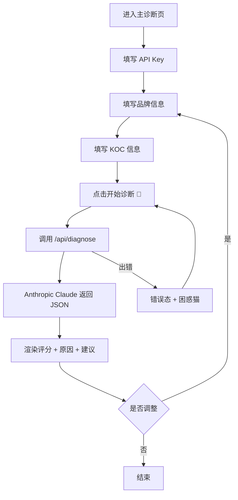

# 猫咪流量诊所 🐾 - 产品需求文档（PRD）

## 1. 产品概述

猫咪流量诊所是一款面向品牌方与内容创作者的轻量级 SaaS 智能匹配工具，通过调用 Anthropic Claude API，对"品牌"与"KOC（关键意见消费者）"的合作匹配度进行智能诊断与可解释性分析。
- 解决品牌投放选号难、KOC 接单匹配度不明的痛点，提供秒级、可量化的匹配建议
- 面向新锐品牌运营、MCN 机构、独立内容创作者，帮助提升投放 ROI 与合作效率

## 2. 核心功能

### 2.1 用户角色

本产品为无登录的轻量工具型应用，所有用户角色一致：用户自行填入 Anthropic API Key 即可使用，无需注册。

| 角色 | 注册方式 | 核心权限 |
|------|----------|----------|
| 普通用户 | 无需注册，自带 API Key | 填写品牌/KOC 信息，发起诊断，查看报告 |

### 2.2 功能模块

本产品为单页应用，所有功能集中在主诊断页：

1. **主诊断页**：顶部品牌区与 API Key 输入区、左侧品牌与 KOC 信息录入区、右侧诊断报告输出区、自定义鼠标指针交互层。

### 2.3 页面详情

| 页面名称 | 模块名称 | 功能描述 |
|----------|----------|----------|
| 主诊断页 | 顶部品牌区 | 展示"猫咪流量诊所 🐾"Logo（衬线大字）、品牌副标语；右侧提供 Anthropic API Key 输入框，配眼睛 icon 切换密码显隐，输入框 focus 时边框平滑过渡为橙色 |
| 主诊断页 | 品牌信息表单 | 输入"产品名称"（文本）、"一句话产品描述"（多行文本）；输入框 focus 时下沉并橙色高亮 |
| 主诊断页 | KOC 信息表单 | 输入"KOC 名字"（文本）、"粉丝数量"（数字，自动千分符显示）、"内容方向"（下拉：美妆/生活/宠物/穿搭/美食/科技/其他） |
| 主诊断页 | 开始诊断按钮 | 橙色胶囊按钮，文字"开始诊断 🐾"，悬停时背景由橙到深橙平滑过渡 + 轻微缩放 + 发光；点击后调用后端 Route Handler，进入加载态 |
| 主诊断页 | 诊断报告 - 空状态 | 引导文案 + 一只静态线条猫咪 icon，提示"填写左侧信息开启诊断"|
| 主诊断页 | 诊断报告 - 加载态 | 显示"诊断中...🐾"，配旋转的猫爪 SVG loading 动效 |
| 主诊断页 | 诊断报告 - 完成态 | ① 匹配度评分（0-100，超大衬线数字 + 数字 count-up 动效 + 对应猫咪表情：≥80 😺，60-79 😸，40-59 😼，20-39 😹，<20 😿）；② 3 条匹配/不匹配原因（分点 icon，依次淡入）；③ 合作建议（灰底卡片，1-2 句） |
| 主诊断页 | 诊断报告 - 错误态 | 友好提示文案 + "困惑猫"表情 😿，附"重试"按钮 |
| 主诊断页 | 自定义鼠标指针 | 圆形跟随指针，悬停可点击元素时圆环放大并反色/半透明；按钮附近磁性吸附 + 橙色发光 |
| 主诊断页 | 入场动效 | 标题、表单分组、按钮 stagger 由下至上位移 + 淡入 |
| 主诊断页 | 平滑滚动 | 全局阻尼感平滑滚动（Lenis 或类似） |

## 3. 核心流程

用户进入页面 → 首次入场动画依次展开 → 用户填入 Anthropic API Key → 用户在左侧依次填写品牌信息与 KOC 信息 → 点击"开始诊断 🐾"按钮 → 前端调用 `/api/diagnose` Route Handler → Route Handler 携带用户 API Key 请求 Anthropic Claude 模型 → 流式/一次性返回结构化 JSON → 右侧区域以 count-up 动效呈现评分与表情、依次淡入原因卡片与合作建议 → 用户可调整输入再次诊断。

## 4. 用户界面设计

### 4.1 设计风格

- **主色**：纯白底 #FFFFFF、深炭黑 #1A1A1A、中性灰 #F5F5F5
- **强调色**：活力橙 #FF6B35（按钮、评分高亮、关键 emoji 点缀、focus 边框）
- **按钮风格**：胶囊形（border-radius: 999px），扁平 + 悬停渐变填充 + 微缩放 + 橙色发光
- **字体**：
  - 标题/评分数字：Playfair Display（衬线，体现"诊断报告"的专业克制感）
  - 正文/表单：Inter（无衬线，保证可读性）
- **布局风格**：左右两栏卡片分栏，桌面端 6:6 或 5:7，移动端上下堆叠；大面积留白；分组用细灰线分隔
- **图标/Emoji**：极简线条猫咪 icon（自绘 SVG）+ 系统 emoji（😺😸😹😼😿🐾），评分动态切换表情

### 4.2 页面设计概览

| 页面名称 | 模块名称 | UI 元素 |
|----------|----------|---------|
| 主诊断页 | 顶部品牌区 | 衬线 Logo "猫咪流量诊所 🐾"（左对齐，36-44px）、右侧密码型输入框 + 眼睛 icon；底部 1px 灰线分割 |
| 主诊断页 | 左侧输入区 | 白底卡片，分组标题"品牌信息""KOC 信息"使用衬线 20px；输入框 1px #E5E5E5 边框，focus 时 #FF6B35 + 阴影下沉 4px；下拉菜单使用原生 select 外观重写 |
| 主诊断页 | 开始诊断按钮 | 胶囊按钮，#FF6B35 → #E85A2A 渐变 hover，14px 字号，hover 时 scale(1.03) + box-shadow 橙色辉光 |
| 主诊断页 | 右侧诊断报告 | 标题"诊断报告"衬线 32px；评分超大衬线 120-160px，颜色 #1A1A1A，悬停时变 #FF6B35；表情 emoji 同行 64-80px |
| 主诊断页 | 合作建议卡片 | 灰底 #F5F5F5，圆角 16px，正文 Inter 14px，行高 1.6 |
| 主诊断页 | 加载态 | 旋转猫爪 SVG（24px），文字"诊断中...🐾"灰色 14px |
| 主诊断页 | 错误态 | "困惑猫" 😿 表情 + 灰色提示文案 + 文字按钮"重试" |
| 主诊断页 | 自定义指针 | 外圆 32px 描边 + 内圆 6px 实心；hover 可点击元素时外圆 scale(1.8) 反色半透明 |

### 4.3 响应式设计

桌面优先（≥1024px 左右两栏布局），移动端（<768px）自动堆叠为单列，输入区在上、报告区在下；触屏设备隐藏自定义指针，恢复系统指针；按钮在触屏改为 tap 反馈而非磁吸。