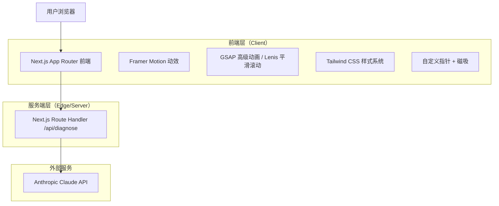
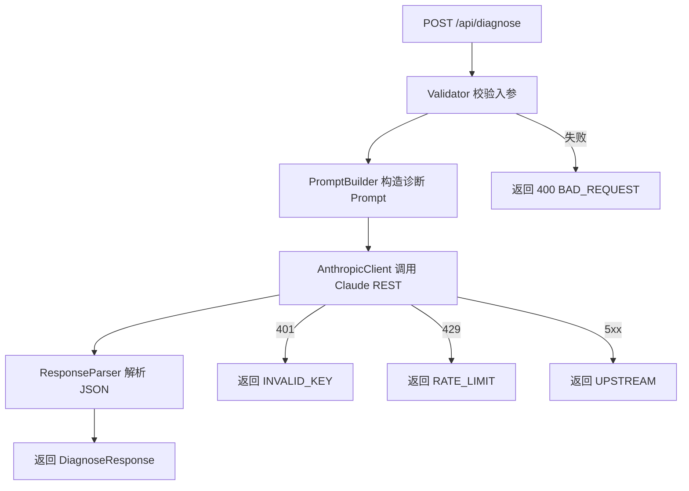

# 猫咪流量诊所 🐾 - 技术架构文档

## 1. 架构设计



## 2. 技术描述

- **框架**：Next.js@14（App Router）+ React@18 + TypeScript
- **初始化工具**：`create-next-app`（App Router + Tailwind + TS）
- **样式**：Tailwind CSS@3，配置自定义颜色（ink/cream/accent 橙）与字体（Playfair Display / Inter）
- **动效**：Framer Motion@11（组件级动画、stagger、count-up）+ GSAP@3（自定义指针、磁吸） + Lenis（平滑滚动）
- **HTTP**：原生 fetch
- **API 代理**：Next.js Route Handler `/api/diagnose`（Node runtime）
- **AI 模型**：Anthropic Claude（model: `claude-3-5-sonnet-latest`），通过 REST 调用，避免引入 SDK 增大体积
- **后端**：仅 Next.js Route Handler，无独立服务
- **数据库**：无（纯无状态工具，所有数据存于前端 state）

## 3. 路由定义

| 路由 | 用途 |
|------|------|
| `/` | 主诊断页（唯一前端页面） |
| `/api/diagnose` | POST：接收品牌与 KOC 信息 + 用户 API Key，代理调用 Anthropic 并返回结构化诊断结果 |

## 4. API 定义

### 4.1 诊断接口

`POST /api/diagnose`

**Request Body**

```typescript
interface DiagnoseRequest {
  apiKey: string;            // 用户提供的 Anthropic API Key
  brand: {
    name: string;            // 产品名称
    description: string;     // 一句话产品描述
  };
  koc: {
    name: string;            // KOC 名字
    followers: number;       // 粉丝数量
    niche:
      | '美妆' | '生活' | '宠物'
      | '穿搭' | '美食' | '科技' | '其他';
  };
}
```

| 字段 | 类型 | 必填 | 描述 |
|------|------|------|------|
| apiKey | string | 是 | sk-ant- 开头的 Anthropic API Key |
| brand.name | string | 是 | 1-50 字符 |
| brand.description | string | 是 | 1-300 字符 |
| koc.name | string | 是 | 1-50 字符 |
| koc.followers | number | 是 | ≥0 整数 |
| koc.niche | enum | 是 | 7 选 1 |

**Response Body**

```typescript
interface DiagnoseResponse {
  score: number;            // 0-100 匹配度
  reasons: Array<{
    type: 'pro' | 'con';    // 匹配 / 不匹配
    text: string;           // 一条原因（≤60 字）
  }>;                       // 长度恰好 3
  suggestion: string;       // 合作建议（≤120 字）
}

interface DiagnoseErrorResponse {
  error: string;            // 友好错误文案
  code: 'INVALID_KEY' | 'RATE_LIMIT' | 'BAD_REQUEST' | 'UPSTREAM' | 'UNKNOWN';
}
```

**示例**

请求：
```json
{
  "apiKey": "sk-ant-xxxx",
  "brand": { "name": "喵选", "description": "面向年轻女性的宠物零食品牌" },
  "koc": { "name": "橘子小姐", "followers": 32000, "niche": "宠物" }
}
```

返回：
```json
{
  "score": 86,
  "reasons": [
    { "type": "pro", "text": "KOC 内容方向与品牌品类高度一致" },
    { "type": "pro", "text": "粉丝量级处于品牌种草甜蜜区间" },
    { "type": "con", "text": "粉丝画像年龄略偏年轻，需关注转化路径" }
  ],
  "suggestion": "建议以宠物日常 vlog 形式植入，搭配限时优惠码评估实际转化。"
}
```

## 5. 服务端架构图



**Prompt 设计要点**：

- 使用 `system` 指令固定 JSON 输出格式与字段；
- `messages` 中将品牌与 KOC 信息以结构化文本传入；
- 强制要求返回严格 JSON（`response_format` 不可用时通过 system prompt 约束 + 服务端正则提取首段 `{...}`）；
- 调用 `claude-3-5-sonnet-latest`，`max_tokens: 800`，`temperature: 0.4`。

## 6. 数据模型

无持久化数据。前端 state 结构如下：

```typescript
type Status = 'idle' | 'loading' | 'success' | 'error';

interface AppState {
  apiKey: string;
  showKey: boolean;
  brand: { name: string; description: string };
  koc:   { name: string; followers: number | ''; niche: string };
  status: Status;
  result: DiagnoseResponse | null;
  errorMsg: string;
}
```